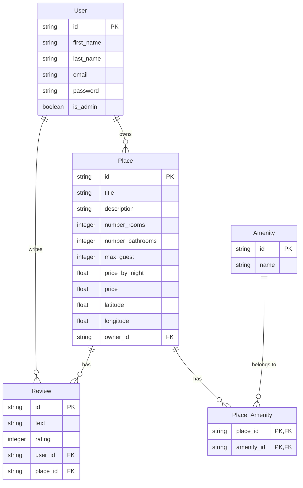

# 🏠 HBnB Project - Part 3

#### **📌 Entity-Relationship Diagram**

```mermaid
erDiagram
    User {
        string id PK
        string first_name
        string last_name
        string email
        string password
        boolean is_admin
    }

    Place {
        string id PK
        string title
        string description
        integer number_rooms
        integer number_bathrooms
        integer max_guest
        float price_by_night
        float price
        float latitude
        float longitude
        string owner_id FK
    }

    Review {
        string id PK
        string text
        integer rating
        string user_id FK
        string place_id FK
    }

    Amenity {
        string id PK
        string name
    }

    Place_Amenity {
        string place_id PK,FK
        string amenity_id PK,FK
    }

    User ||--o{ Place : "owns"
    User ||--o{ Review : "writes"
    Place ||--o{ Review : "has"
    Place ||--o{ Place_Amenity : "has"
    Amenity ||--o{ Place_Amenity : "belongs to"
``` 