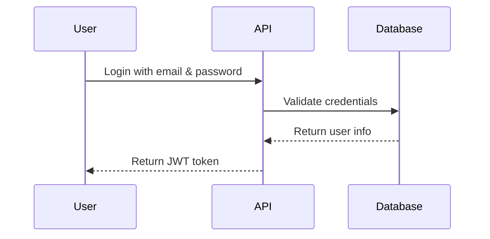
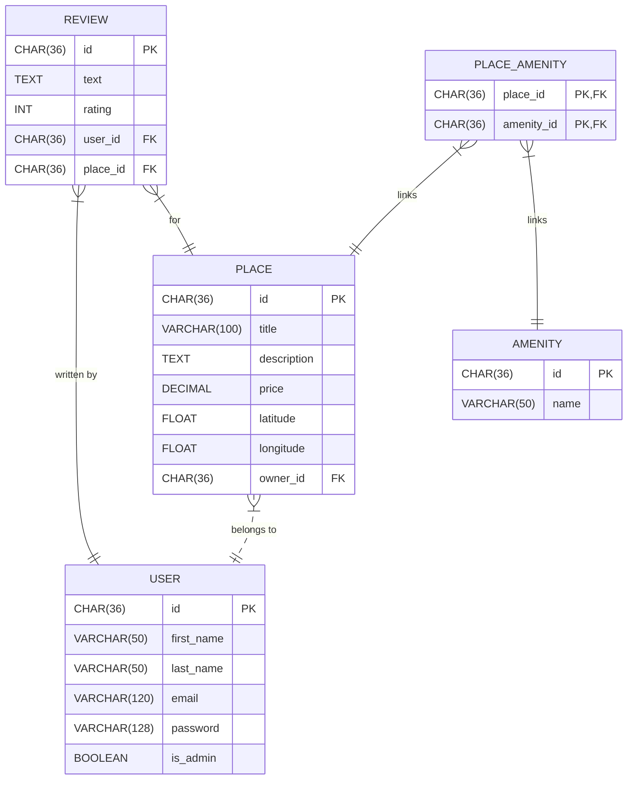

# 🏠 HBnB Project - Part 3

## **📌 Project Overview**
The **HBnB Evolution** project is an **Airbnb-like application** built with **Flask, SQLAlchemy, and JWT authentication**. This repository contains the **backend implementation for Part 3**, focusing on **user authentication, database integration, and API security**.

## **📂 Contents**
This repository includes:
- ✅ **JWT-based Authentication**
- ✅ **Role-Based Access Control (Admin & Users)**
- ✅ **SQLAlchemy Database Integration**
- ✅ **CRUD Operations with Persistent Storage**
- ✅ **Mermaid.js ER Diagram for Database Visualization**
- ✅ **SQL Scripts for Table Generation and Initial Data**

## **🛠️ Technologies Used**
- **Python** 🐍 - Flask (REST API)
- **SQLAlchemy** 🟤 - ORM for database management
- **Flask-JWT-Extended** 🔒 - Authentication & security
- **SQLite / MySQL** 🟢 - Database storage (development & production)
- **Mermaid.js** 📊 - ER diagrams & database visualization

## **🪢 Part 3: Backend Development & Database Integration**
### **1⃣ User Authentication with JWT**
Users authenticate using **JWT tokens**, allowing secure login. The system supports **role-based access** (`is_admin` flag). **Password hashing** is implemented using **bcrypt**.

#### **📌 User Login Flow**


### **2⃣ Database Integration with SQLAlchemy**
Switched from **in-memory storage** to **persistent database storage**. Used **SQLAlchemy ORM** for database operations. Database supports **SQLite** (development) and **MySQL** (production).

#### **📌 Entity-Relationship Diagram**


### **3⃣ API Endpoints with Role-Based Access**
| **Endpoint**            | **Method**   | **Access**         | **Description**                             |
|-------------------------|--------------|--------------------|---------------------------------------------|
| `/api/v1/auth/login`    | `POST`       | Public             | User login & JWT token generation           |
| `/api/v1/users/`        | `POST`       | Admin              | Create a new user                           |
| `/api/v1/users/<id>`     | `PATCH`      | Admin/User         | Update user profile                         |
| `/api/v1/places/`       | `POST`       | Authenticated Users| Create a new place                          |
| `/api/v1/places/<id>`    | `PUT/DELETE` | Owner/Admin        | Modify or delete a place                    |
| `/api/v1/reviews/`      | `POST`       | Authenticated Users| Submit a review                             |
| `/api/v1/reviews/<id>`   | `PUT/DELETE` | Owner/Admin        | Modify or delete a review                   |

### **4⃣ SQL Scripts for Database Setup**
A **schema.sql** file was created to generate all tables and insert initial data.

#### **📌 SQL Table Creation (Example)**
```sql
CREATE TABLE users (
    id INTEGER PRIMARY KEY AUTOINCREMENT,
    username VARCHAR(80) NOT NULL UNIQUE,
    email VARCHAR(120) NOT NULL UNIQUE,
    password_hash VARCHAR(128) NOT NULL,
    is_admin BOOLEAN DEFAULT 0,
    created_at DATETIME DEFAULT CURRENT_TIMESTAMP,
    updated_at DATETIME DEFAULT CURRENT_TIMESTAMP
);
```

## **🚀 How to Run This Project**
### **1⃣ Clone the Repository**
```sh
git clone https://github.com/judiihh/holbertonschool-hbnb.git
cd holbertonschool-hbnb/part3
```

### **2⃣ Set Up the Virtual Environment**
```sh
python3 -m venv venv
source venv/bin/activate  # On Windows: venv\Scripts\activate
```

### **3⃣ Install Dependencies**
```sh
pip install -r requirements.txt
```

### **4⃣ Initialize the Database**
```sh
flask db init
flask db migrate -m "Initial migration"
flask db upgrade
```

### **5⃣ Run the API**
```sh
flask run
```

## **💡 Future Work**
- 🔹 **Deploy to a production environment using MySQL**
- 🔹 **Implement Frontend for HBnB**
- 🔹 **Optimize API performance and add caching**

## **👤 Author**
- **Judith Espinal** - Holberton School Student 