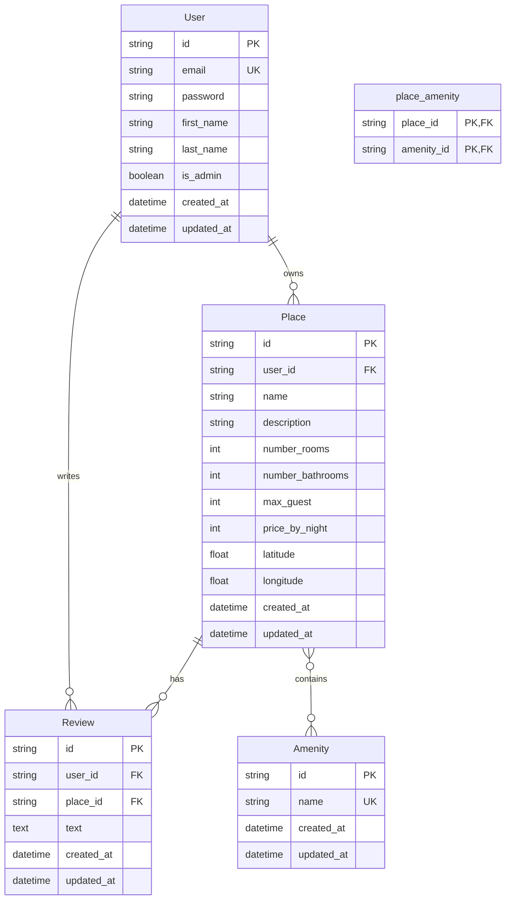

# Entity Relationship Diagram for HBnB

The following diagram represents the database schema for the HBnB application.

## Schema Description

### User
- Represents a user of the application
- Has a one-to-many relationship with Place (one user can own many places)
- Has a one-to-many relationship with Review (one user can write many reviews)
- Contains authentication information including password (hashed)

### Place
- Represents a accommodation listing
- Belongs to a User (owner)
- Has a one-to-many relationship with Review (one place can have many reviews)
- Has a many-to-many relationship with Amenity (one place can have many amenities, and each amenity can be in many places)

### Review
- Represents a review written by a User for a Place
- Belongs to both a User and a Place

### Amenity
- Represents a feature or amenity that a Place may have
- Has a many-to-many relationship with Place

### place_amenity
- Junction table to model the many-to-many relationship between Place and Amenity 